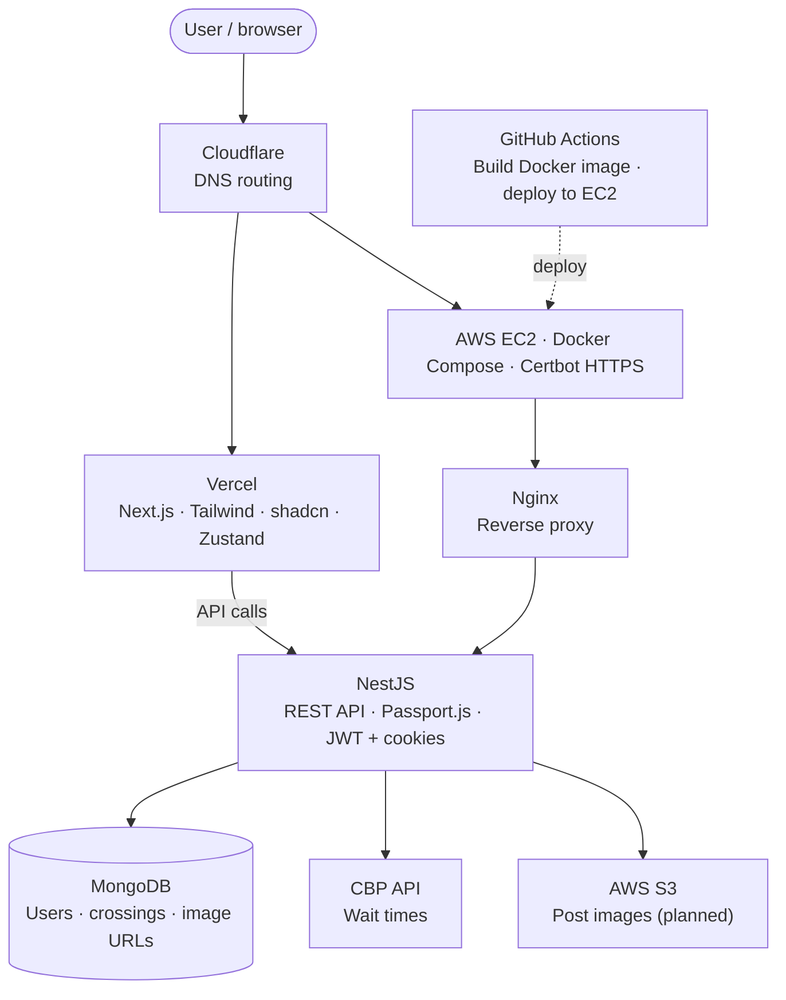

# EasyBorder
## ⚡️Live Web-App: https://easyborder.io/

## About
EasyBorder provides reliable border wait times using official CBP data for all port of entries and crossing methods. Compare crossings, save your favorite lanes, and share your border crossing experiences with other travelers.

### The Problem
The San Diego/Tijuana broder is the busiest land border crossing 
in the world with 200,000 to 300,000 people crossing daily. For 
thousands of them, knowing the wait time is not optional. It is 
essential. Students need to make it to class on time. Workers need 
to make it to their jobs. Families crossing daily cannot afford to 
guess.

The official CBP app is a solid source but it can be unreliable.
Wait times are sometimes wrong or missing entirely. And a number 
never tells the full story anyway. Protests at the border, cartel 
related activity, lane closures, and other unexpected situations 
can completely change the lines at the border.

This is why I created EasyBorder. It combines official CBP wait time 
data with a community feed where travelers share real photos 
and updates directly from the crossing so you always know what is 
actually happening at the border before you leave the house.

## Tech Stack
**Frontend:** Typescript, Next.js, Tailwind, Shadcn, Bun, Tanstack Query, React-Hook-Form, Zod, Zustand

**Backend:** TypeScript, Nest.js, MongoDB

**Auth:** Passport.js, jwts, cookies

**Infra:** AWS EC2, Nginx, Docker Compose, Github Actions

## Architecture

