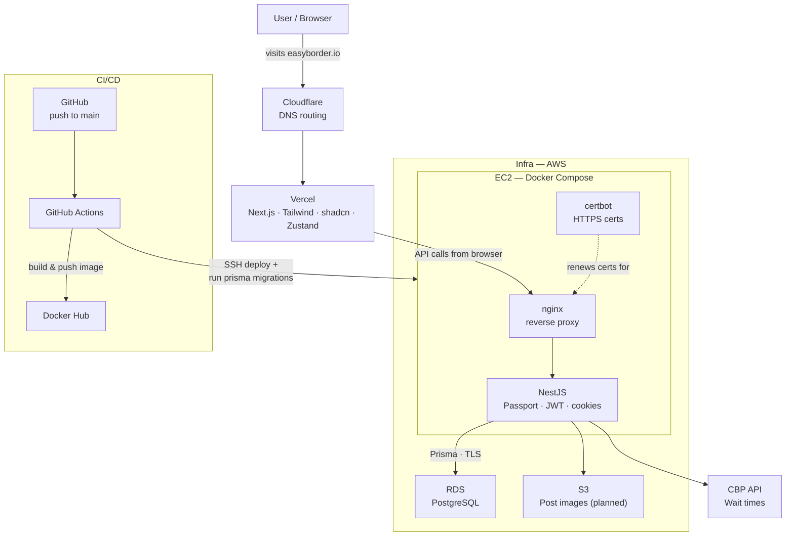

# EasyBorder
## ⚡️Live Web-App: https://easyborder.io/

## About
EasyBorder provides reliable border wait times using official CBP data for all port of entries and crossing methods. Compare crossings, save your favorite lanes, and share your border crossing experiences with other travelers.

## The Problem
The San Diego/Tijuana border is the busiest land border crossing 
in the world with 200,000 to 300,000 people crossing daily. For 
thousands of them, knowing the wait time is not optional. It is 
essential. Students need to make it to class on time. Workers need 
to make it to their jobs. Families crossing daily cannot afford to 
guess.

The official CBP app is a solid source but it can be unreliable.
Wait times are sometimes wrong or missing entirely. And a number 
never tells the full story anyway. Protests at the border, cartel 
related activity, lane closures, and other unexpected situations 
can completely change the lines at the border.

This is why I created EasyBorder. It combines official CBP wait time 
data with a community feed where travelers share real photos 
and updates directly from the crossing so you always know what is 
actually happening at the border before you leave the house.

## Features
- Border wait times for all US ports of entry and crossing methods
- Compare wait times across multiple crossings and lanes
- Save your favorite crossings for quick access
- Community feed where travelers post updates and photos about their border wait experiences
- Authentication with Passport.js, JWTs, and cookies

## Tech Stack
**Frontend:** TypeScript, Next.js, Tailwind, Shadcn, Bun, Tanstack Query, React-Hook-Form, Zod, Zustand

**Backend:** TypeScript, NestJS, Prisma

**Database:** PostgreSQL (AWS RDS)

**Auth:** Passport.js, JWTs, cookies

**Infra:** AWS EC2, AWS RDS, AWS S3 (planned), Nginx, Certbot, Docker Compose, Docker Hub, GitHub Actions

## Architecture

```mermaid
flowchart TD
    User["User / Browser"] -->|"visits easyborder.io"| CF["Cloudflare<br/>DNS routing"]
    CF --> Vercel["Vercel<br/>Next.js · Tailwind · shadcn · Zustand"]
    Vercel -->|"API calls from browser"| Nginx

    subgraph Infra["Infra — AWS"]
        subgraph EC2["EC2 — Docker Compose"]
            Nginx["nginx<br/>reverse proxy"]
            Certbot["certbot<br/>HTTPS certs"]
            Backend["NestJS<br/>Passport · JWT · cookies"]

            Nginx --> Backend
            Certbot -.->|renews certs for| Nginx
        end

        RDS["RDS<br/>PostgreSQL"]
        S3["S3<br/>Post images (planned)"]

        Backend -->|"Prisma · TLS"| RDS
        Backend --> S3
    end

    Backend --> CBP["CBP API<br/>Wait times"]

    subgraph CICD["CI/CD"]
        GH["GitHub<br/>push to main"] --> GHA["GitHub Actions"]
        GHA -->|"build & push image"| DH["Docker Hub"]
        GHA -->|"SSH deploy +<br/>run prisma migrations"| EC2
    end
```

**Request flow:** the browser loads the frontend from Vercel, then makes API calls directly to `api.easyborder.io`, which hits nginx on the EC2 instance. Nginx reverse-proxies to the NestJS backend, which queries PostgreSQL on RDS via Prisma over an encrypted (TLS) connection, and also pulls live wait times from the CBP API.

**Deploy flow:** pushing to `main` triggers GitHub Actions, which builds and pushes a Docker image to Docker Hub, then SSHes into EC2 to pull the new image, run any pending Prisma migrations against RDS, and restart the backend container.
